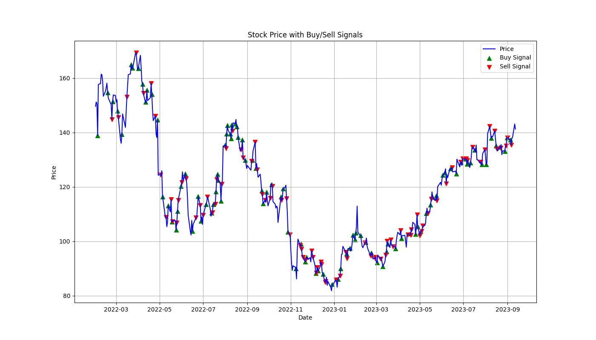
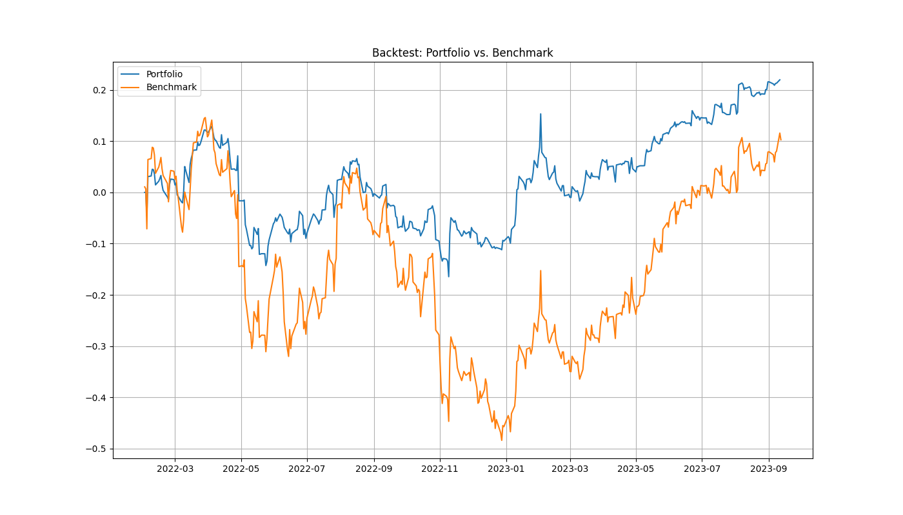

## Deep Q-Learning Stock Trading Agent

This project trains and tests a deep Q-learning agent for stock trading using technical indicators as state inputs.

### Table of Contents

1. [Installation](#installation)
2. [How to Use](#how-to-use)
3. [Structure](#structure)
4. [Example](#example)
5. [License](#license)

### Installation

1. Clone the repository:
   ```bash
   git clone https://github.com/zuhaalfaraj/stock_market_trading_agent.git
   ```

2. Change directory:
   ```bash
   cd stock_market_trading_agent
   ```

3. Install required packages:
   ```bash
   pip install -r requirements.txt
   ```

### How to Use

1. **Training the Agent**:

   Use the following command to train the agent:
   ```bash
   python main.py --symbol "AAPL" --start_date "2017-01-01" --end_date "2022-01-01" --cash 10000 --episodes 500
   ```

   **Parameters**:

   - `--symbol`: Stock symbol you wish to trade. Default is 'AAPL'.
   - `--start_date`: Start date for training data. Default is '2017-01-01'.
   - `--end_date`: End date for training data. Default is today's date.
   - `--cash`: Initial cash amount. Default is 10000.
   - `--episodes`: Number of training episodes. Default is 500.
   - `--hidden_dim`: NN hidden states dimension. Default is 128.
   - `--gamma`: Q Learning discount rate (gamma). Default is 0.99.
   - `--epsilon`: Exploration rate. Default is 0.9.
   - `--epsilon_decay`: Decay rate for epsilon. Default is 0.999.
   - `--epsilon_min`: Minimum epsilon value. Default is 0.01.
   - `--lr`: Learning rate for the neural network. Default is 1e-5.

   **Choosing Hyperparameters**:
   
   - `--hidden_dim`: Choose a higher value for complex data but beware of overfitting. 
   - `--gamma`: Close to 1 makes the agent prioritize long-term reward over short-term reward.
   - `--epsilon`: High values encourage exploration while low values encourage exploitation.
   - `--epsilon_decay`: A higher decay will reduce the exploration rate faster after each episode.
   - `--epsilon_min`: Setting a reasonable minimum ensures that the agent continues to explore.
   - `--lr`: A higher learning rate might make the learning unstable, while a lower one can slow down the training.

   Carefully adjust hyperparameters based on the training performance. Use validation or out-of-sample data to check if the model is overfitting.

2. **Testing the Agent**:

   To test the agent, use the following command:
   ```bash
   python test.py --symbol "VZ" --start_date "2023-03-01" --end_date "2023-06-01" --cash 10000 --model_path "models/best_model.pth"
   ```

   - `--symbol`: Stock symbol you wish to test. Default is 'VZ'.
   - `--start_date`: Start date for testing data. Default is '2023-03-01'.
   - `--end_date`: End date for testing data. Default is today's date.
   - `--cash`: Initial cash amount. Default is 10000.
   - `--model_path`: Path to the trained model. Default is 'models/best_model.pth'.

### Structure

- `data.py`: Contains functionalities for data preparation and extraction of technical indicators.
- `environment.py`: Defines the trading environment.
- `train.py`: Contains code to train the deep Q-learning agent.
- `test.py`: Contains code to test the trained agent and visualize the performance.
- `trading_agent.py`: Defines the DQAgent and its functionalities.

### Example

Let's walk through an example using the Amazon (AMZN) stock. We'll demonstrate how the trained agent produces trading signals, and compare the portfolio's performance to a simple buy-and-hold strategy (Benchmark).

1. **Run the Test Script**:

   Use the following command to test the trained agent:
   ```bash
   python predict.py --symbol "AMZN" --start_date "2022-03-01" --end_date "2023-09-01" --cash 10000 --model_path "models/best_model.pth"
   ```

2. **View the Results**:

   After running the script, you'll find several result files in the `results/AMZN` directory:

   - `signals.png`: This image displays the stock price with buy (green) and sell (red) signals generated by the trained agent.

   - `backtest.png`: This image shows the backtest results, comparing the portfolio's performance to a simple buy-and-hold strategy (Benchmark).

3. **Interpretation**:

   - **Buy and Sell Signals**: Analyze the buy and sell signals in `signals.png`. Green markers indicate buy signals, while red markers represent sell signals. Use these signals to gain insights into the agent's decision-making process.

   - **Backtest Results**: Examine `backtest.png` to compare the portfolio's performance to a buy-and-hold strategy. This visual representation allows you to assess the agent's effectiveness in trading.

   - **Fine-Tuning**: Based on the backtest results, consider fine-tuning hyperparameters and training the agent further to optimize its performance.

4. **Iterate and Improve**:

   Repeat the training and testing process, adjusting hyperparameters as needed, to develop a trading strategy that aligns with your goals and risk tolerance.

5. **Additional Notes**:

   - Ensure the `models/` directory contains the trained model you want to use for testing (`best_model.pth` in this case).

   - Customize the `--start_date` and `--end_date` parameters to specify the testing period you're interested in.
6. **Example Results**
   
   


### License

This project is licensed under the MIT License. See `LICENSE` for more details.
